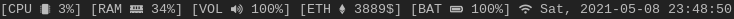

# DWM status
<br>
A custom status utility for the dynamic window manager.

## Dependencies
* dwm
* xsetroot
* NVIDIA Management Library (optional)

## Configuration
Configuring some parameters will be supported in the future through the classic config.h.

## Installation
Installation is simple, just type ```sudo make install```.

### NVIDIA GPU support
If you have an NVIDIA graphics card, you might want to uncoment lines 4 and 5 of the Makefile.<br>
This feature is currently only supported with the proprietary NVIDIA driver.<br>
It may be required to change the -I and -L options in CFLAGS and LIBS respectively to the corresponding directory where CUDA is installed on your system.
